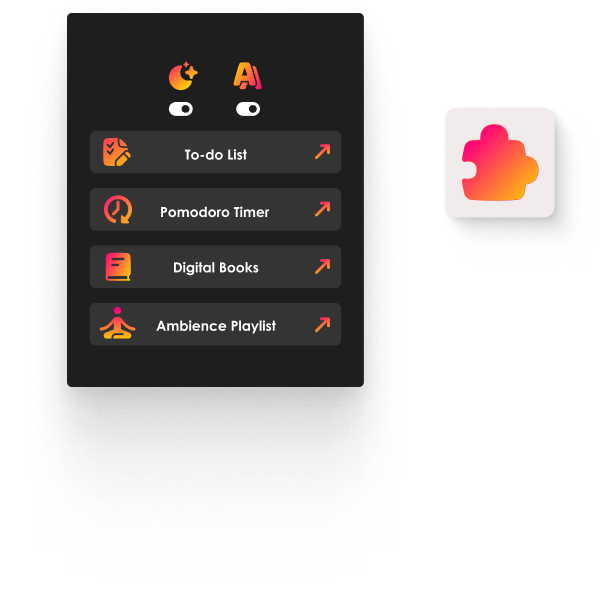

# 🦊 MindFlow: Firefox add-on

    

# ✏️ Description 
Hi there! I've created this browser extension especially for folks with ADHD and dyslexia, but in reality this addon is really useful for anyone who wants to create a productive study environment!

I'm really passionate about making the web more accessible and enjoyable for everyone. With this add-on, I'm hoping to make your web browsing experience better by offering tools that provide a simple and distraction-free study environment.

# 💡Features
Here are some of the features this browser extension has to offer!

1) You can change the font to either OpenDyslexic or CenturyGothic
2) Switch between dark and light themes
3) Access direct links to:
   1) 🍅 Pomodoro Timer
   2) ✅ To-do lists
   3) 🍃 Ambience playlists to help you focus
   4) 🎧 Audiobooks

I highly recommend using this add-on with an ad-blocker for an ad-free experience

# 👉 Get the extension [here](https://addons.mozilla.org/pt-PT/firefox/addon/accessible-adhd-dyslexia-addon/)

# 🔍 References

- [Pomodoro Timer](https://pomofocus.io/)
- [To-do List](https://tweek.so/)
- [Digital Books Repository](https://www.digitalbook.io/)
- [Ambience Music](https://www.youtube.com/@Lullablocks)
- [Accessibility Persona Cards](https://journals.gmu.edu/index.php/ITLCP/article/view/2516/1559) by Vivian Motti & Ester Dura
- [OpenDyslexic Font](https://opendyslexic.org/) designed to mitigate dyslexia symptoms
- [CenturyGothic](https://en.wikipedia.org/wiki/Century_Gothic) is a dyslexia-friendly non-serif font
- [Uiverse](https://uiverse.io/gharsh11032000/moody-dog-23) for open source UI components
- [Streamline](https://home.streamlinehq.com/) for free icons
- [Figma](https://www.figma.com/) for prototyping
- [Mozilla Extension Workshop](https://extensionworkshop.com/?utm_content=header-link&utm_medium=referral&utm_source=addons.mozilla.org) 
- [MDN Web Docs](https://developer.mozilla.org/en-US/)
